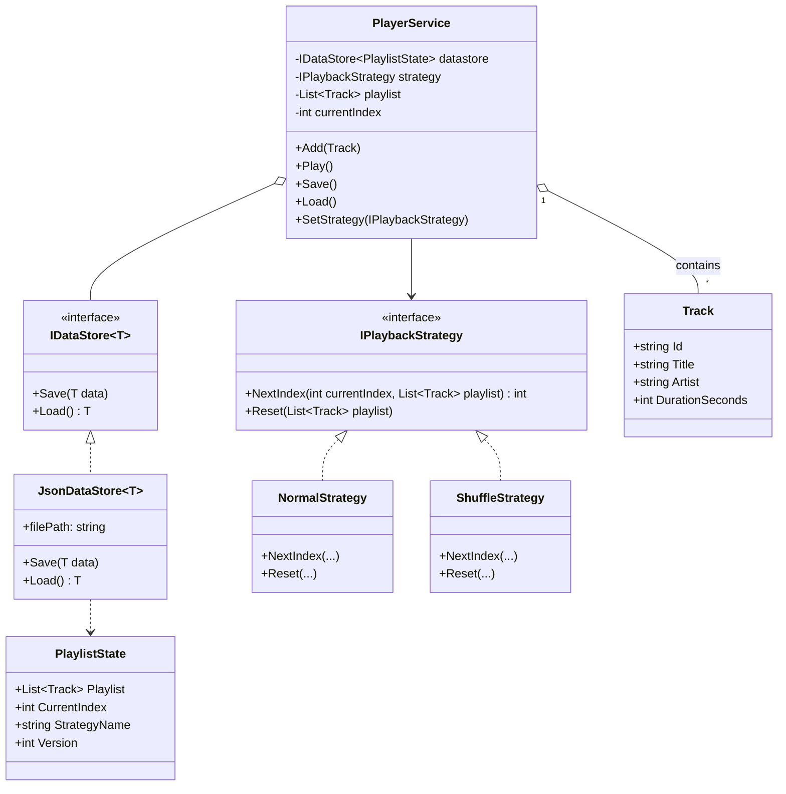

```mermaid
classDiagram
    class IDataStore~T~ {
        <<interface>>
        +Save(T data)
        +Load() T
    }

    class JsonDataStore~T~ {
        +filePath: string
        +Save(T data)
        +Load() T
    }

    IDataStore~T~ <|.. JsonDataStore~T~

    class IPlaybackStrategy {
        <<interface>>
        +NextIndex(int currentIndex, List~Track~ playlist) int
        +Reset(List~Track~ playlist)
    }

    class NormalStrategy {
        +NextIndex(...)
        +Reset(...)
    }

    class ShuffleStrategy {
        +NextIndex(...)
        +Reset(...)
    }

    IPlaybackStrategy <|.. NormalStrategy
    IPlaybackStrategy <|.. ShuffleStrategy

    class PlayerService {
        -IDataStore~PlaylistState~ datastore
        -IPlaybackStrategy strategy
        -List~Track~ playlist
        -int currentIndex
        +Add(Track)
        +Play()
        +Save()
        +Load()
        +SetStrategy(IPlaybackStrategy)
    }

    PlayerService o-- IDataStore~PlaylistState~
    PlayerService --> IPlaybackStrategy
    PlayerService "1" o-- "*" Track : contains

    class Track {
        +string Id
        +string Title
        +string Artist
        +int DurationSeconds
    }

    class PlaylistState {
        +List~Track~ Playlist
        +int CurrentIndex
        +string StrategyName
        +int Version
    }

    JsonDataStore~PlaylistState~ ..> PlaylistState
```
