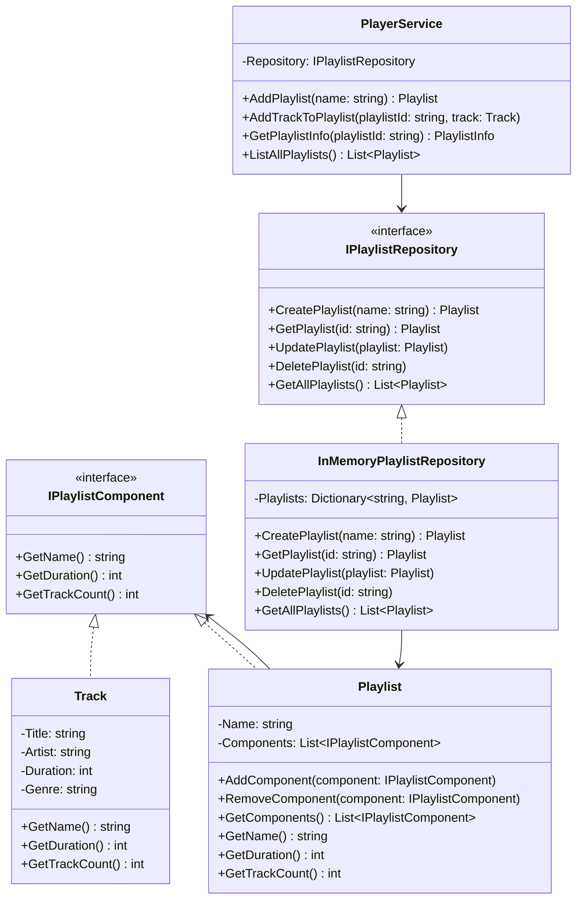

# Class Diagram

```mermaid
classDiagram
    %% Domain Layer
    class IPlaylistComponent {
        <<interface>>
        +GetName() string
        +GetDuration() int
        +GetTrackCount() int
    }

    class Track {
        -Title: string
        -Artist: string
        -Duration: int
        -Genre: string
        +GetName() string
        +GetDuration() int
        +GetTrackCount() int
    }

    class Playlist {
        -Name: string
        -Components: List~IPlaylistComponent~
        +AddComponent(component: IPlaylistComponent)
        +RemoveComponent(component: IPlaylistComponent)
        +GetComponents() List~IPlaylistComponent~
        +GetName() string
        +GetDuration() int
        +GetTrackCount() int
    }

    %% Application Layer
    class IPlaylistRepository {
        <<interface>>
        +CreatePlaylist(name: string) Playlist
        +GetPlaylist(id: string) Playlist
        +UpdatePlaylist(playlist: Playlist)
        +DeletePlaylist(id: string)
        +GetAllPlaylists() List~Playlist~
    }

    class PlayerService {
        -Repository: IPlaylistRepository
        +AddPlaylist(name: string) Playlist
        +AddTrackToPlaylist(playlistId: string, track: Track)
        +GetPlaylistInfo(playlistId: string) PlaylistInfo
        +ListAllPlaylists() List~Playlist~
    }

    %% Infrastructure Layer
    class InMemoryPlaylistRepository {
        -Playlists: Dictionary~string, Playlist~
        +CreatePlaylist(name: string) Playlist
        +GetPlaylist(id: string) Playlist
        +UpdatePlaylist(playlist: Playlist)
        +DeletePlaylist(id: string)
        +GetAllPlaylists() List~Playlist~
    }

    %% Relationships
    IPlaylistComponent <|.. Track
    IPlaylistComponent <|.. Playlist
    Playlist --> IPlaylistComponent
    PlayerService --> IPlaylistRepository
    IPlaylistRepository <|.. InMemoryPlaylistRepository
    InMemoryPlaylistRepository --> Playlist
```
