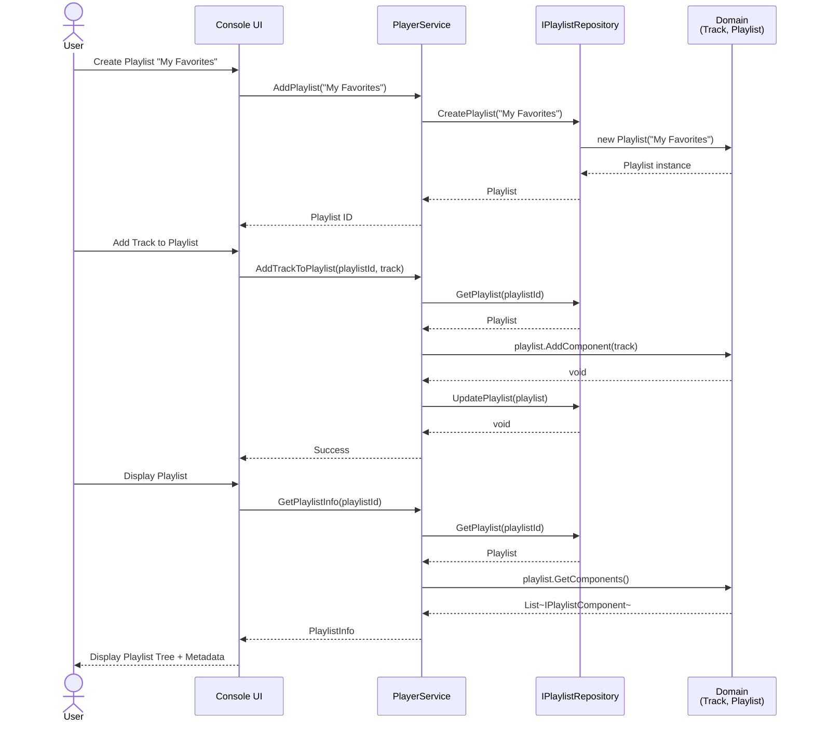

# Vertical Slice Sequence Diagram

```mermaid
sequenceDiagram
    actor User
    participant Console as Console UI
    participant PlayerSvc as PlayerService
    participant Repository as IPlaylistRepository
    participant Domain as Domain<br/>(Track, Playlist)

    User->>Console: Create Playlist "My Favorites"
    Console->>PlayerSvc: AddPlaylist("My Favorites")
    PlayerSvc->>Repository: CreatePlaylist("My Favorites")
    Repository->>Domain: new Playlist("My Favorites")
    Domain-->>Repository: Playlist instance
    Repository-->>PlayerSvc: Playlist
    PlayerSvc-->>Console: Playlist ID

    User->>Console: Add Track to Playlist
    Console->>PlayerSvc: AddTrackToPlaylist(playlistId, track)
    PlayerSvc->>Repository: GetPlaylist(playlistId)
    Repository-->>PlayerSvc: Playlist
    PlayerSvc->>Domain: playlist.AddComponent(track)
    Domain-->>PlayerSvc: void
    PlayerSvc->>Repository: UpdatePlaylist(playlist)
    Repository-->>PlayerSvc: void
    PlayerSvc-->>Console: Success

    User->>Console: Display Playlist
    Console->>PlayerSvc: GetPlaylistInfo(playlistId)
    PlayerSvc->>Repository: GetPlaylist(playlistId)
    Repository-->>PlayerSvc: Playlist
    PlayerSvc->>Domain: playlist.GetComponents()
    Domain-->>PlayerSvc: List~IPlaylistComponent~
    PlayerSvc-->>Console: PlaylistInfo
    Console-->>User: Display Playlist Tree + Metadata
```
